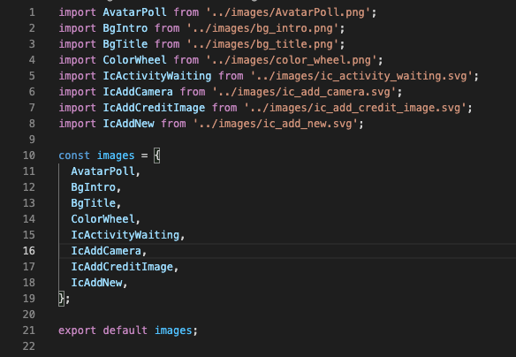

# **Project: Auto Import Images**

## Written during working time at VMO - SDC2, the project aims to improve one's coding skills.


As mentioned in the title, we're going to implement a way to auto import all images in the project's folder.

## **Step 1: Identify image types**

To begin with, we need to know which image formats are commonly used in Mobile Dev.

### **Common image file classification**


| Abbreviation | MIME type  | File Extension(s)                | Summary                                                                                 |
|------------- |------------|--------------------------------- |-----------------------------------------------------------------------------------------|
| **JPEG**     | image/jpeg | .jpg, .jpeg, .jfif, .pjpeg, .pjp | Good choice for lossy compression of still images (currently the most popular).         |
| **PNG**      | image/png  | .png                             | PNG provides more precise reproduction of source images, or when transparency is needed.|
| **SVG**      | image/svg  | .svg	                           | Scalable images.                                                                        |

## **Step 2: Build a fresh app**
Second of all, we'll need to build a fresh app following the instructions of the [documentation]

## **Step 3: Install libraries**

What we'll have to do next is to **add external node modules** for unsupported image types, e.g: **Svg**...

In this case, we need 2 libraries which are: 

    > react-native-svg && react-native-svg-transformer

Therefore, we have 2 steps:

### **Step 1: Install react-native-svg**

Make sure that you have installed and linked react-native-svg library:

https://github.com/react-native-community/react-native-svg#installation


As my **RN Version** is **post 0.6**, this can be implemented automatically:

1. Install library from npm

        > yarn add react-native-svg

2. Link native code

    With autolinking (react-native 0.60+)

        > cd ios && pod install

    Pre 0.60

        > react-native link react-native-svg

### **Step 2: Install react-native-svg-transformer library**

    > yarn add --dev react-native-svg-transformer

### **Step 3: Configure the react native packager**

Merge the contents from our project's `metro.config.js` file with this config (create the file if it does not exist already).

The config file will help us detect **svg** types and make use of them.

`metro.config.js`:

```js
const {getDefaultConfig} = require('metro-config');

module.exports = (async () => {
  const {
    resolver: {sourceExts, assetExts},
  } = await getDefaultConfig();
  return {
    transformer: {
      babelTransformerPath: require.resolve('react-native-svg-transformer'),
    },
    resolver: {
      assetExts: assetExts.filter(ext => ext !== 'svg'),
      sourceExts: [...sourceExts, 'svg'],
    },
  };
})();
```

### Using TypeScript

In my case, I need to add this into the `declarations.d.ts` file (create one if it doesn't exist):

```ts
declare module '*.png' {
  const content: number;
  export default content;
}
declare module '*.jpg' {
  const content: number;
  export default content;
}
declare module '*.svg' {
  import {SvgProps} from 'react-native-svg';

  const content: React.FC<SvgProps>;
  export default content;
```

## **Step 4: Implement auto-import**
Create a `.js` file in the root folder. Mine is `autoImportSvg.js`.

Since the auto-import progress involves working with a file system, the first thing to be included is:

```js
const fs = require('fs');
```


Second of all, we'll need to create a writable destination:

```js
let createImgIndex = fs.createWriteStream('./src/asset/images/index.ts'),
  importText = '',
  constant = '';
```

Thirdly, to read all the files inside the target folder, we'll add: 

```js
let imagesList = fs
  .readdirSync('./src/asset/images', {withFileTypes: true})
  .filter(item => !item.isDirectory())
  .map(item => item.name);
```

Next up is classifying compatible file types: 

```js
let imageType = /(\.jpg|\.jpeg|\.png|\.svg)$/i;
```

Then, with each file read and imported, we'll use `regex` to remove special characters and `.toUpperCase` to rename them:

```js
let removeSpecial = image.replace(/[^a-zA-Z ]/g, ' ');
    let addUpper = removeSpecial
      .split(' ')
      .map(word => word.charAt(0).toUpperCase() + word.slice(1));
    let joinText = addUpper.join('');
```

After that, we'll join all the text together, preparing to write:

**Import**

```js
    importText += `import ${joinText.substring(
      0,
      joinText.length - 3,
    )} from '../images/${image}';\n`;
```

**Constants**

```js
    constant += ` ${joinText.substring(0, joinText.length - 3)},\n`;
```

As `imageList` will be returned as an array, we'll have to put all the text-changing functions in a loop, thus we have:

```js
imagesList.forEach(function (image) {
  if (image.match(imageType)) {
    let removeSpecial = image.replace(/[^a-zA-Z ]/g, ' ');
    let addUpper = removeSpecial
      .split(' ')
      .map(word => word.charAt(0).toUpperCase() + word.slice(1));
    let joinText = addUpper.join('');
    importText += `import ${joinText.substring(
      0,
      joinText.length - 3,
    )} from '../images/${image}';\n`;
    constant += ` ${joinText.substring(0, joinText.length - 3)},\n`;
  }
});
```

Finally, we'll write into the `index.ts` file: 

```js
createImgIndex.write(importText);
createImgIndex.write(`\nconst images = { ${constant} }\n`);
createImgIndex.write('\nexport default images');
createImgIndex.end();
```

**To sum up**, the **Node** system file should be written as follow: 

```js
const fs = require('fs');

let createImgIndex = fs.createWriteStream('./src/asset/images/index.ts'),
  importText = '',
  constant = '';

let imagesList = fs
  .readdirSync('./src/asset/images', {withFileTypes: true})
  .filter(item => !item.isDirectory())
  .map(item => item.name);

let imageType = /(\.jpg|\.jpeg|\.png|\.svg)$/i;

imagesList.forEach(function (image) {
  if (image.match(imageType)) {
    let removeSpecial = image.replace(/[^a-zA-Z ]/g, ' ');
    let addUpper = removeSpecial
      .split(' ')
      .map(word => word.charAt(0).toUpperCase() + word.slice(1));
    let joinText = addUpper.join('');
    importText += `import ${joinText.substring(
      0,
      joinText.length - 3,
    )} from '../images/${image}';\n`;
    constant += ` ${joinText.substring(0, joinText.length - 3)},\n`;
  }
});

createImgIndex.write(importText);
createImgIndex.write(`\nconst images = { ${constant} }\n`);
createImgIndex.write('\nexport default images');
createImgIndex.end();
```

Alright, now the finishing touch is to run:

    > nodemon autoImportSvg.js

And we'll have the `index.ts` file containing all imported and exported images as desired.




[//]: #Reference
[documentation]: <https://reactnative.dev/docs/environment-setup>